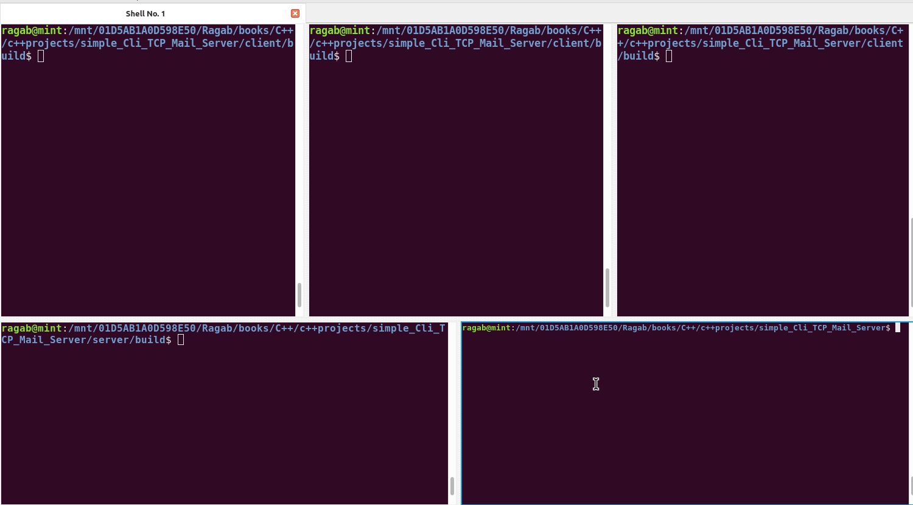

# Simple Mail Server and Client

This repository contains a simple mail server and client applications implemented in C++. The server handles basic email functionalities such as sending, retrieving sent messages, and retrieving received messages, while the client allows users to interact with the server.

## Table of Contents

- [Simple Mail Server](#simple-mail-server)
  - [Overview](#overview)
  - [Components](#components)
  - [Usage](#usage)
  - [Features](#features)
  - [Dependencies](#dependencies)
  - [Contributors](#contributors)
  - [License](#license)
- [Simple Mail Client](#simple-mail-client)
  - [Overview](#overview-1)
  - [Components](#components-1)
  - [Usage](#usage-1)
  - [Features](#features-1)
  - [Dependencies](#dependencies-1)
  - [Contributors](#contributors-1)
  - [License](#license-1)
- [Demonstration](#demonstration)

## Simple Mail Server

### Overview
The Simple Mail Server is a lightweight TCP-based server application designed to handle basic email functionalities such as sending, retrieving sent messages, and retrieving received messages. It utilizes SQLite for database management and JSON for communication between the server and clients.

### Components
- **Server**: Handles incoming client connections and requests.
- **ServerSocket**: Provides socket functionality for the server.
- **SQLiteDatabase**: Manages the SQLite database for storing messages.
- **ClientRequestHandler**: Handles client requests and interacts with the database.
- **JsonHandler**: Serializes and deserializes JSON data for communication.

### Usage
1. **Clone the Repository**: `git clone <repository-url>`
2. **Build the Server**:
    ```bash
    cd server
    mkdir build && cd build
    make
    ```
3. **Run the Server**: `./server`
4. **Connect Clients**: Implement a client application to connect to the server for sending and receiving messages.

### Features
- Send messages to other users.
- Retrieve sent messages.
- Retrieve received messages.
- Quit the application.

### Dependencies
- SQLite3
- JSONCPP
- CMake (for building)

### Contributors
- [Ragab](https://github.com/ragab2010)

### License
This project is licensed under the [MIT License](LICENSE).

## Simple Mail Client

### Overview
The Simple Mail Client is a command-line client application designed to interact with the Simple Mail Server. It allows users to send messages to other users, retrieve sent messages, retrieve received messages, and quit the application.

### Components
- **Client**: Main executable for the client application.
- **JsonHandler**: Serializes and deserializes JSON data for communication with the server.

### Usage
1. **Clone the Repository**: `git clone https://github.com/Ragab2010/Simple_TCP_Mail_Server_and_Client.git`
2. **Build the Client**:
    ```bash
    cd client
    mkdir build && cd build
    make
    ```
3. **Run the Client**: `./client <username>`
    - Replace `<username>` with your desired username.
4. **Follow the Menu**: Use the command-line menu to interact with the server.

### Features
- Send messages to other users.
- Retrieve sent messages.
- Retrieve received messages.
- Quit the application.

### Dependencies
- JSONCPP
- CMake (for building)

## Demonstration



## License
This project is licensed under the [MIT License](LICENSE).
